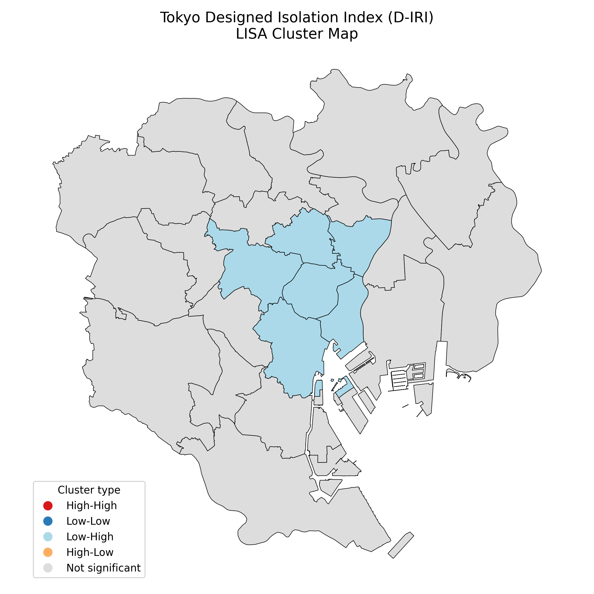
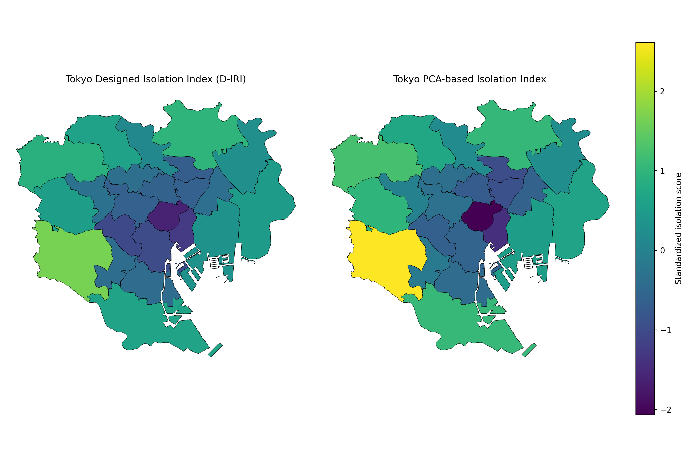

# 🏙️ Tokyo Urban Isolation Index  
### Social Isolation Risk Modeling for Tokyo’s 23 Wards

This project builds a data-driven **Isolation Risk Index (IRI)** for Tokyo, integrating demographic, socioeconomic, accessibility, transit, and spatial clustering methods. It provides a replicable urban analytics workflow for identifying areas where older adults may face elevated isolation risk.

---

## 🗺️ Key Maps

> ⚠️ These image paths assume the plots are saved under `out/spatial_tokyo/`.  
> If your files are in a different folder, just adjust the paths below.

### 1. Tokyo Designed Isolation Index (D-IRI)


### 2. Local Moran’s I (LISA) Cluster Map



### 3. Designed vs PCA Isolation Index (Side-by-Side)



---

## 📌 Project Overview

Two complementary indices are constructed:

### 1. **Designed Isolation Index (D-IRI)**  
A theory-driven composite index using standardized indicators:
- 👵 Percent of residents aged 65+
- 🏠 Percent of older adults living alone
- 💴 Poverty rate
- 🏥 Accessibility score (distance / access to community resources)
- 🚉 Transit density (rail station density)

### 2. **PCA-Based Isolation Index**  
A data-driven index based on **PC1** from principal component analysis.

These allow comparison between a conceptual model and an empirical (unsupervised) model.

---

## ⚙️ Features & Capabilities

### **Data Ingestion**
- Loads demographics and SES data  
- Imports accessibility proxy data  
- Processes railway station geodata and computes station density  

### **Feature Engineering**
- Z-score scaling for comparability  
- Access score computation  
- Transit score computation  
- Full dataset merging with spatial geometries  

### **Index Construction**
- Designed Isolation Index (D-IRI)  
- PCA Isolation Index (PC1)  

### **Statistical Analysis**
- 📈 Correlation analysis  
- 🧮 PCA loadings and explained variance  
- 📉 OLS regression diagnostics  
- 🌐 Global Moran’s I (spatial autocorrelation)  
- 🗺️ LISA cluster detection (local spatial clusters)  

### **Visualization**
- Choropleth: Designed IRI  
- Choropleth: PCA IRI  
- Side-by-side comparison maps  
- LISA cluster map (High-High, Low-Low, etc.)

---

## 🔍 Key Findings (Current Results)

- The **D-IRI and PCA index strongly agree**, validating the conceptual model.  
- **Spatial clustering is significant** (Moran’s I > 0, p ≈ 0.003).  
- Central wards form **Low-Low clusters** (low isolation surrounded by low isolation).  
- Several outer wards show **higher isolation**, influenced by aging, single-living rates, poverty, and weaker transit/access.

---

## 📁 Project Structure

```text
urban-isolation-index/
│
├── data/
│   ├── external/         # GeoJSON and external sources
│   ├── raw/              # Unprocessed inputs
│   ├── interim/          # Intermediate feature layers
│   └── processed/        # Final merged datasets
│
├── scripts/
│   ├── build_designed_index.py
│   ├── plot_tokyo_index_comparison.py
│   ├── plot_tokyo_diri_and_lisa_maps.py
│   ├── 07_ingest_tokyo_access.py
│   ├── 08_merge_access.py
│   ├── 09_ingest_transit_alt.py
│   └── 10_merge_transit.py
│
├── src/cli/
│   ├── 04_validate_spatial.py
│   ├── 06_modeling_suite.py
│   ├── 11_spatial_stats_tokyo.py
│   └── ...
│
├── out/
│   ├── plots/
│   ├── spatial_tokyo/
│   │   ├── tokyo_designed_index.png
│   │   ├── tokyo_diri_lisa_clusters.png
│   │   └── tokyo_diri_vs_pca.png
│   └── modeling_with_access/
│       ├── ols_with_access_summary.txt
│       └── ols_with_access_coefs.csv
│
└── README.md


---


