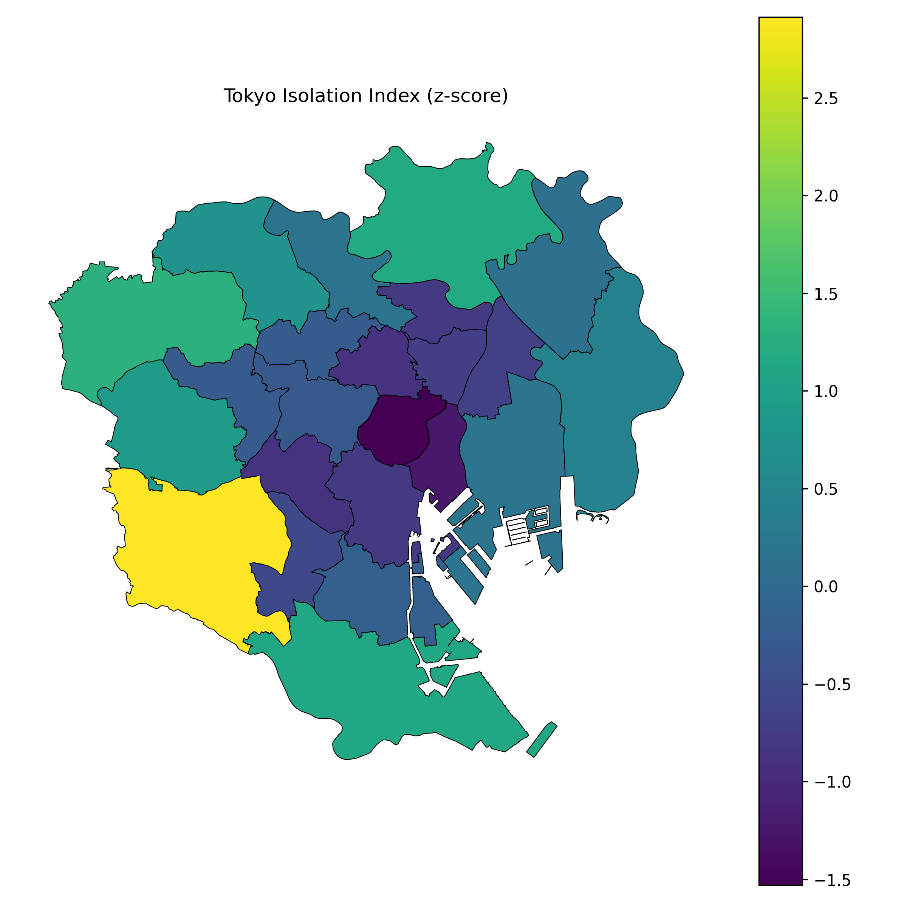

# 🏙️ Tokyo Urban Isolation Index  
### Social Isolation Risk Modeling for Tokyo’s 23 Wards

This project develops a strong spacial social data science framework in order to quanify and vizualize the urban social isolation risk, specifically for older adults in Tokyo's 23 wards. This project uses the 2020 Population Census (e-Stat). Japan's rapid aging demographic, as well as the rise of single elderly households have made social isolation (社会的孤立) an important policy concern. This study applies rigorious spacial, computational, and statistical methods in order to examine how demographic, socioeconomic, and accessibility factors often interact to create isolation risk across different urban neighborhoods and living situations.

# Executive Summary 

### Research Contribution
The project constructs a reproducible Designed Isolation Index (D-IRI) using ward-level indicators:
- Percentage of residents aged 65+
- Percentage of older adults living alone
- Poverty-related socioeconomic measures
- Transit accessibility (rail station density)
- Spatial access to community facilities

All variables are normalized and combined into a composite index grounded in social epidemiology and urban studies. The index is further validated using Principal Component Analysis (PCA) to confirm its latent structure and identify dominant dimensions of vulnerability.

### Spacial Data Science Approach
Using GeoPandas and PySAL, the project applies advanced spatial statistics including:
- Global Moran’s I to assess spatial autocorrelation
- Local Indicators of Spatial Association (LISA)
- High/low-risk cluster detection (High-High, Low-Low, etc.)

These methods reveal clear geographic patterns: core wards with strong transit access and higher affluence show consistently low isolation risk, while peripheral wards exhibit clustering of higher vulnerability.

### Reproducible Computational Workflow
A modular Python pipeline automates:
1. Data ingestion from the e-Stat API
2. Cleaning and feature engineering
3.Construction of D-IRI
4.PCA-based alternative index
5. Spatial statistics and ward-level mapping


All intermediate and processed datasets are output in Parquet and CSV formats, making the analysis transparent and fully reproducible.


### Future Development
Current work focuses on extending the same framework to Osaka City, pending identification of suitable ward-level aging indicators from e-Stat. This multi-city expansion will enable comparative urban aging research across major Japanese metropolitan regions.

---

## 🗺️ Key Maps

> These image paths exist under `out/spatial_tokyo/` and `out/maps/`.

### 1. Tokyo Designed Isolation Index (D-IRI)


### 2. Local Moran’s I (LISA) Cluster Map


### 3. Designed vs PCA Isolation Index (Full Size)


---

## 📌 Methods Overview

Two complementary indices are constructed:

### **1. Designed Isolation Index (D-IRI)**
A theory-driven composite index using standardized indicators:
- 👵 Percent of residents aged 65+
- 🏠 Percent of older adults living alone
- 💴 Poverty rate
- 🏥 Accessibility score (distance to community resources)
- 🚉 Transit density (rail station density)

### **2. PCA-Based Isolation Index**
A data-driven index based on **PC1** from principal component analysis.

These allow comparison between a conceptual model and an empirical (unsupervised) model.

---

## Features & Capabilities

### Data Ingestion
- Demographics and SES ingestion  
- Accessibility dataset ingestion  
- Transit geodata ingestion  

### Feature Engineering
- Z-score scaling  
- Access score computation  
- Transit score computation  
- Spatial merge with ward polygons  

### Index Construction
- Designed Isolation Index (D-IRI)  
- PCA Isolation Index  

### Spatial Statistics
- Global Moran’s I  
- Local Moran’s I (LISA clusters)  
- Regression diagnostics  

### Visualization Outputs
- Designed IRI map  
- PCA IRI map  
- Side-by-side comparison  
- LISA cluster map  

---

## 🔍 Key Findings (Current Results)

- The **D-IRI and PCA index strongly correlate**, validating the conceptual model.
- **Spatial clustering is statistically significant** (Moran’s I ≈ 0.23, p ≈ 0.003).
- Central wards show **Low-Low** isolation clusters.
- Outer wards show **higher isolation** driven by aging, single-living, and weaker transit/access.

---

## 📁 Project Structure

```text
urban-isolation-index/
│
├── data/
│   ├── external/            # GeoJSON + e-Stat source files
│   ├── raw/                 # Unprocessed downloads
│   ├── interim/             # Intermediate engineered layers
│   └── processed/           # Final merged datasets (Tokyo)
│
├── scripts/
│   ├── build_designed_index.py
│   ├── plot_tokyo_index_comparison.py
│   ├── plot_tokyo_diri_and_lisa_maps.py
│   ├── 07_ingest_tokyo_access.py
│   ├── 08_merge_access.py
│   ├── 09_ingest_transit_alt.py
│   └── 10_merge_transit.py
│
├── src/cli/
│   ├── 04_validate_spatial.py
│   ├── 06_modeling_suite.py
│   ├── 11_spatial_stats_tokyo.py
│   └── ...
│
├── out/
│   ├── maps/
│   │   ├── tokyo_iso_index.png
│   │   ├── tokyo_iso_index_comparison.png
│   ├── spatial_tokyo/
│   │   ├── tokyo_diri_lisa_clusters.png
│   │   ├── tokyo_diri_vs_pca.png
│   └── modeling_with_access/
│       ├── ols_with_access_summary.txt
│       └── ols_with_access_coefs.csv
│
└── README.md


